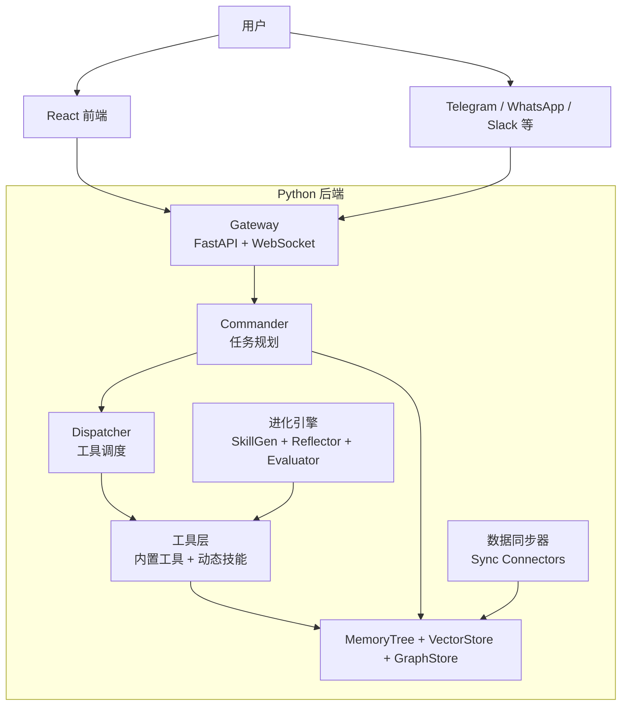

# lengxiaobei

> 一个融合 OpenClaw、Hermes、OpenHuman 核心思想的自主进化智能体框架  
> 专为本地部署设计，支持多渠道接入、长期记忆树和自我技能进化

## 目录

- [项目概述](#项目概述)
- [设计哲学](#设计哲学)
- [整体架构](#整体架构)
- [快速开始](#快速开始)
- [后端模块详解](#后端模块详解)
- [前端模块详解](#前端模块详解)
- [数据与存储](#数据与存储)
- [开发与扩展](#开发与扩展)
- [FAQ](#faq)

## 项目概述

**lengxiaobei** 是一个面向个人和团队的自主 AI 智能体系统，旨在提供一个**本地优先、可自进化、多渠道统一**的智能助理。

### 核心特性

| 特性 | 说明 |
|------|------|
| **自主进化** | 基于 Hermes 闭环学习，从执行轨迹中提炼新技能 |
| **记忆树** | 参考 OpenHuman，构建结构化、可编辑的个人知识库 |
| **多渠道接入** | 继承 OpenClaw 网关设计，支持 WebSocket、Telegram、WhatsApp、Slack 等边界 |
| **本地优先** | 运行数据默认存储在本地 SQLite、文件系统和可选向量库中 |
| **可视化控制台** | React + TypeScript 前端，管理记忆、技能、进化过程和系统设置 |
| **工具生态** | 内置文件、Shell、Web、浏览器等工具，支持动态技能安装与审核 |

### 参考项目

- [OpenClaw](https://github.com/OpenClaw) - 多渠道网关与工具调度
- [Hermes](https://github.com/NousResearch/Hermes) - 技能自生成与反思引擎
- [OpenHuman](https://github.com/OpenHuman) - 记忆树结构与外部数据同步

## 设计哲学

lengxiaobei 将三个项目的核心思想有机融合：

> **OpenClaw 提供骨架：接入 + 调度**  
> **OpenHuman 提供血脉：记忆 + 数据**  
> **Hermes 提供灵魂：学习 + 进化**

整体遵循以下原则：

- **模块解耦**：Gateway、Commander、Dispatcher、Memory、Evolution、Tools 之间通过明确接口协作。
- **配置即代码**：技能、运行参数和同步边界尽量保持文件化、可审查、可回滚。
- **本地优先**：核心聊天、记忆、技能生成与审核不依赖云服务。
- **安全沙箱**：工具执行默认受限，Shell 工具偏只读，动态技能默认 pending，需审核后启用。
- **渐进式复杂**：从基础聊天开始，逐步启用同步、浏览器自动化、向量库和进化等高级能力。
- **可选真实适配器**：Telegram、WhatsApp、Slack、Playwright Browser、Chroma 等均是可选真实适配边界；未安装依赖或未配置凭据时，系统使用本地 fallback 或返回明确错误。

## 整体架构



### 技术栈

| 层次 | 技术选型 |
|------|----------|
| **后端语言** | Python 3.10+ |
| **Web 框架** | FastAPI + WebSocket |
| **数据库** | SQLite 主存储 + Chroma/FAISS 可选向量增强 |
| **任务调度** | 本地轻量调度，APScheduler 可选 |
| **LLM 集成** | Ollama / MLX / OpenAI 兼容 API |
| **前端语言** | TypeScript 5+ |
| **前端框架** | React 18 + Vite + TailwindCSS |
| **状态管理** | Zustand |

## 快速开始

### 环境要求

- macOS、Linux 或 Windows WSL2
- Python 3.10+
- Node.js 18+
- [Ollama](https://ollama.com/) 可选，用于本地模型

### 安装步骤

```bash
# 1. 克隆项目
git clone https://github.com/lengxiaobei/lengxiaobei.git
cd lengxiaobei

# 2. 配置环境变量
cp .env.example .env
# 按需编辑 .env，例如 LLM_PROVIDER、LLM_BASE_URL、LLM_API_KEY

# 3. 安装依赖
make setup

# 4. 启动后端
make backend

# 5. 启动前端（另一个终端）
make frontend

# 6. 访问控制台
open http://127.0.0.1:5173
```

后端默认地址为 `http://127.0.0.1:8000`，FastAPI 文档位于 `http://127.0.0.1:8000/docs`。

### 手动安装后端依赖

```bash
python3 -m venv .venv
source .venv/bin/activate
pip install -e ".[dev]"

# 可选增强：Chroma、FAISS、Playwright、APScheduler 等
pip install -e ".[dev,full]"
```

### Docker Compose

```bash
docker compose up -d
```

当前 Compose 配置会启动后端和 Redis，并挂载本地 `data/` 目录。前端开发服务仍可用 `make frontend` 单独启动。

## 后端模块详解

### `backend/gateway/` - 接入网关

| 文件 | 功能 | 参考 |
|------|------|------|
| `server.py` | WebSocket + HTTP 服务入口 | OpenClaw Gateway |
| `channels/base.py` | 渠道抽象基类 | - |
| `channels/websocket.py` | 前端 UI 渠道 | - |
| `channels/telegram.py` | Telegram Bot 适配边界 | python-telegram-bot |
| `channels/whatsapp.py` | WhatsApp 桥接边界 | Baileys bridge |
| `channels/slack.py` | Slack Bot 适配边界 | Slack API |
| `auth.py` | JWT、设备配对、allowlist 相关能力 | OpenClaw |

### `backend/core/` - 智能中枢

| 文件 | 功能 | 参考 |
|------|------|------|
| `commander.py` | 任务拆解、规划器、LLM 调用入口 | OpenClaw Agent Core |
| `dispatcher.py` | 工具调度、子任务分发、trace 记录 | OpenClaw Dispatcher |
| `context.py` | 会话上下文管理和短期记忆 | - |
| `runtime_factory.py` | 组装 SQLite、Memory、Tools、Evolution 等运行时依赖 | - |
| `llm/ollama.py` | 本地 Ollama 模型适配 | - |
| `llm/mlx.py` | Apple MLX 模型适配边界 | - |

### `backend/memory/` - 记忆系统

| 文件 | 功能 | 参考 |
|------|------|------|
| `tree.py` | 记忆树核心，支持节点 CRUD、分层路径和摘要 | OpenHuman |
| `vector_store.py` | 向量检索，默认本地 hash fallback，可选 Chroma/FAISS | OpenClaw Long-term |
| `graph_store.py` | 图谱关系存储，基于 SQLite，可选 NetworkX 扩展 | OpenClaw Knowledge |
| `sqlite_backend.py` | SQLite 主存储实现 | - |
| `sync/manager.py` | 数据同步调度和连接器注册 | OpenHuman |
| `sync/connectors/` | Gmail、Notion、Slack、GitHub 等同步边界 | OpenHuman |
| `sync/cleaner.py` | HTML 到 Markdown、去噪、文本清洗 | OpenHuman |

### `backend/evolution/` - 进化引擎

| 文件 | 功能 | 参考 |
|------|------|------|
| `skill_gen.py` | 从执行轨迹生成 YAML 技能草稿 | Hermes |
| `skill_store.py` | 技能存储，YAML + SQLite 索引 | - |
| `reflector.py` | 主动反思引擎和改进建议 | Hermes |
| `evaluator.py` | 技能成功率评估和计数 | Hermes |
| `templates/skill_template.yaml` | 技能文件模板 | - |

### `backend/tools/` - 工具执行层

| 目录/文件 | 功能 | 参考 |
|-----------|------|------|
| `registry.py` | 工具注册表，管理内置工具和动态技能 | OpenClaw |
| `sandbox.py` | 安全沙箱，限制 subprocess 和资源使用 | - |
| `builtin/filesystem.py` | 文件读写和目录遍历 | OpenClaw Toolkits |
| `builtin/shell.py` | Shell 命令执行，默认偏只读 | OpenClaw |
| `builtin/web.py` | HTTP 请求和网页抓取 | OpenClaw |
| `builtin/browser.py` | 浏览器自动化，Playwright 可选 | OpenClaw |
| `skills/` | 动态生成的技能文件存放处 | Hermes |

### `backend/api/` - REST API

| 路由 | 功能 |
|------|------|
| `/api/conversations` | 对话历史 CRUD |
| `/api/memory` | 记忆树操作 |
| `/api/skills` | 技能列表、审核、手动编辑 |
| `/api/channels` | 渠道配置 |
| `/api/evolution` | 进化事件、反思和评估数据 |
| `/api/system` | 系统状态、日志、运行时信息 |

所有 API 返回 JSON，遵循 REST 风格。详细文档可访问 `http://127.0.0.1:8000/docs`。

### `backend/utils/` - 通用工具

| 文件 | 功能 |
|------|------|
| `logger.py` | 结构化日志 |
| `token_counter.py` | Token 计数与文本压缩辅助 |
| `markdown_utils.py` | Markdown 处理工具 |
| `task_queue.py` | 后台任务队列，用于同步、学习等任务 |

## 前端模块详解

### 页面结构

| 页面 | 路由 | 功能 |
|------|------|------|
| `ChatPage` | `/` | 主聊天界面，支持多渠道会话 |
| `MemoryPage` | `/memory` | 记忆树可视化和节点编辑 |
| `SkillsPage` | `/skills` | 技能列表、YAML 编辑、审核队列 |
| `EvolutionPage` | `/evolution` | 实时事件流、反思记录、技能成功率趋势 |
| `SettingsPage` | `/settings` | 渠道配置、模型参数、同步设置 |

### 核心组件

| 组件 | 功能 |
|------|------|
| `ThinkingPanel` | 展示 Agent 思考链路、任务拆解、工具调用和结果 |
| `MemoryTreeView` | 记忆树图形化展示，支持展开、选择和编辑 |
| `SkillEditor` | YAML 技能编辑器 |
| `ReviewQueue` | 展示待人工审核的新生成技能 |
| `SyncStatus` | 显示各数据源同步状态 |

### 状态管理

```text
frontend/src/stores/chatStore.ts       # 对话消息、当前会话
frontend/src/stores/memoryStore.ts     # 记忆树节点、展开状态
frontend/src/stores/skillStore.ts      # 技能列表、待审核项
frontend/src/stores/systemStore.ts     # 连接状态、系统资源
frontend/src/stores/evolutionStore.ts  # 进化事件和评估状态
```

### WebSocket 通信

前端通过 WebSocket 接收：

- 实时对话流
- Agent 思考过程事件
- 工具调用和执行结果
- 进化引擎日志
- 系统通知

## 数据与存储

所有运行时数据位于 `data/` 目录，默认完全本地化，可直接备份。

```text
data/
├── sqlite/agent.db        # 主数据库
├── chroma/                # 可选向量数据库持久化
├── skills/                # 待审核或已审核的技能 YAML
├── logs/                  # 应用日志
└── uploads/               # 用户上传附件
```

### 数据库核心表

| 表名 | 说明 |
|------|------|
| `conversations` | 多渠道对话记录 |
| `memory_nodes` | 记忆树节点、摘要、路径、嵌入和元数据 |
| `skills` | 技能元数据、审核状态和成功失败计数 |
| `tool_traces` | 工具执行轨迹，供 SkillGen 和 Evaluator 使用 |
| `graph_edges` | 记忆图谱关系 |
| `user_profile` | 用户画像键值对 |
| `sync_status` | 外部服务同步状态 |

详细字段参见 [docs/schema.md](docs/schema.md)。

## 开发与扩展

### 添加新的消息渠道

1. 继承 `backend/gateway/channels/base.py` 中的 `BaseChannel`。
2. 实现发送和接收方法。
3. 在 Gateway 或运行时装配处注册。

```python
class DiscordChannel(BaseChannel):
    async def send_message(self, text: str, **kwargs):
        # 调用 Discord API
        ...
```

### 创建内置工具

在 `backend/tools/builtin/` 下新建工具模块，实现清晰的 async 执行入口，并在 `backend/tools/registry.py` 中注册。

```python
async def execute(expression: str) -> str:
    # 示例仅用于说明；真实工具不要直接 eval 未信任输入。
    return str(expression)
```

### 新增数据同步连接器

1. 在 `backend/memory/sync/connectors/` 下新建连接器模块。
2. 实现拉取更新的方法，返回清洗后的 Markdown 或结构化记录。
3. 在 `backend/memory/sync/manager.py` 的连接器注册表中启用。

### 自定义技能模板

修改 `backend/evolution/templates/skill_template.yaml`，或通过前端 `SkillEditor` 编辑生成后的技能 YAML。新生成技能默认处于 `pending` 状态，需要人工审核后才会被 Dispatcher 调用。

## FAQ

**Q: 必须使用 Ollama 吗？**  
A: 不必须。系统支持 Ollama、MLX 边界和 OpenAI 兼容 API。配置 `.env` 中的 `LLM_PROVIDER`、`LLM_BASE_URL`、`LLM_API_KEY` 即可。

**Q: 记忆树与向量库的关系是什么？**  
A: 记忆树负责结构化、可编辑的长期记忆；向量库负责语义检索。未启用 Chroma/FAISS 时，系统使用本地 hash 向量 fallback，保证基础检索链路可运行。

**Q: 技能自动生成的安全机制是什么？**  
A: 新生成技能默认是 `pending`，需要用户在 `SkillsPage` 审核通过后才允许被 Dispatcher 调用。工具 trace 和成功率会持续写入 SQLite，供后续评估使用。

**Q: 可以完全离线运行吗？**  
A: 可以。使用 Ollama 或本地 MLX 模型，并关闭外部同步服务。核心聊天、记忆、技能学习和本地工具均可离线工作。

**Q: 未安装 Playwright 或 Chroma 会怎样？**  
A: Playwright Browser 和 Chroma 都是可选真实适配器。未安装时，浏览器工具会返回明确错误或 fallback 提示；向量检索会退回本地实现。

**Q: 如何备份数据？**  
A: 复制 `data/` 目录即可。恢复时替换该目录并重启后端。
